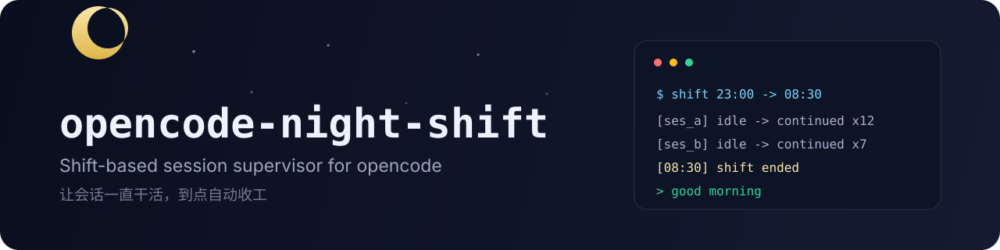
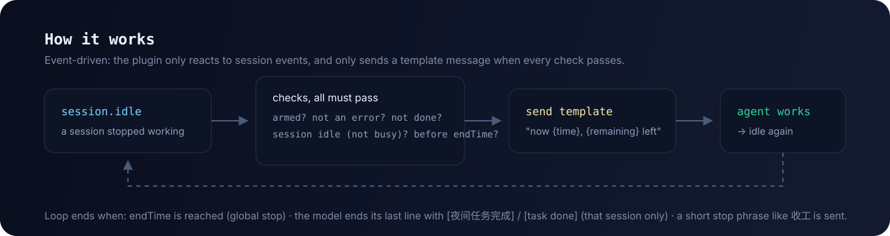

<div align="center">



[English](README.md) · **简体中文**

[](https://github.com/kujiangmudao/opencode-night-shift/actions/workflows/ci.yml)
[](https://www.npmjs.com/package/opencode-night-shift)
[](LICENSE)
[](#安装)
[](#安装)

**给一个或多个 opencode 会话安排一个班次，设好结束时间，然后去睡觉。会话一直干活，到点自动收工。**

**[安装](#安装) · [快速开始](#快速开始) · [配置](#配置) · [工作原理](#工作原理) · [常见问题](#常见问题)**

</div>

## 为什么不是「又一个自动续跑」

市面上已有不少 auto-continue / loop 插件（`opencode-auto-resume`、`opencode-loop`、goal 模式等），它们回答的是「别停下来」。本项目回答的是另一个问题：**「替我值一个班」**。

| | 常见 auto-continue / loop | Night-shift |
| --- | --- | --- |
| 停止条件 | 无限循环 / 目标完成 | **到点收工**（`endTime`，如 `08:30`） |
| 会话数量 | 通常单会话 | **一个班次值守多个会话**，各自计数 |
| 消息内容 | 固定「继续」 | **模板 + 真实时间锚点**（`{time}` / `{remaining}`） |
| 忙碌会话 | 少数处理 | **每次发送前复查**，绝不插队进正在跑的回合 |
| 完成语义 | 全局停止 | **只移除完成的那个会话**，其余继续 |
| 依赖 | 不一 | **零依赖** |

典型用法：把夜里的活交给一个班次，睡觉；早上看 `night-shift.log`——夜里被拉起几次、每个会话干到几点、几点收工，一目了然。

## 功能

- **班次窗口**：`enabled` + `endTime`，到点全局停止
- **多会话**：一次值守多个会话；完成标记只移除对应会话
- **真实时间锚点**：`{time}` / `{remaining}` 用本地真实时间渲染，顺带压掉「天亮了我不干了」的时间幻觉
- **误判防护**：自己发的消息不触发；`别收工` 不触发；完成标记只认最后一行（兼容 markdown 加粗与全角括号）
- **忙碌感知**：`busy`/`retry` 时跳过，下次空闲自动恢复
- **从不中止会话**：卡死恢复交给专门插件
- **检查很快**：通过 `message.updated` 只取最后一条助手消息（取不到时回退全量）
- **有测试**：22 个单元测试，CI 覆盖 Linux + Windows × Node 20/22

## 安装

要求 [opencode](https://opencode.ai)（插件 API `@opencode-ai/plugin` 1.18.x），Node ≥ 20，无任何运行依赖。

**方式一：npm 安装（推荐）**

```jsonc
// opencode.json
{
  "$schema": "https://opencode.ai/config.json",
  "plugin": ["opencode-night-shift"]
}
```

**方式二：手动安装**

把 `src/night-shift.js` 复制到 `~/.config/opencode/plugins/`，重启 opencode。

数据目录：

- 从源码检出运行 → `<仓库>/data/`
- npm 安装 → `~/.local/share/opencode-night-shift/`

都可以用 `OC_NIGHT_DIR` 覆盖。

## 快速开始

在数据目录创建（或编辑）`night-shift.json`——插件按文件修改时间热加载，不需要重启：

```json
{
  "enabled": true,
  "endTime": "08:30",
  "message": "现在是 {time}（距离结束还有 {remaining}）。\n\n请继续未完成的任务，不要停止、不要等待用户输入。\n如果已经完成，请自行 review 或运行测试验证。\n确认无误后，在最后单独输出一行：[夜间任务完成]",
  "sessions": [
    { "id": "ses_你的会话ID", "sent": 0, "lastSentAt": 0 }
  ]
}
```

会话 ID 形如 `ses_...`；也可以使用可选的网页面板勾选会话、设置班次。

**结束一个班次**（任一即可）：

- 到达 `endTime`（全局停止）
- 在任一被值守会话里发**以停止词开头的短消息**：`收工` / `先收工吧` / `停止夜班，睡觉了`（`别收工` 不会误触发）
- 模型最后一行输出 `[夜间任务完成]` / `[task done]`（只停那个会话）

**看它干了什么**：数据目录下的 `night-shift.log` 记录每次续跑、跳过原因和停止原因。

## 配置

| 字段 | 说明 |
| --- | --- |
| `enabled` | 班次开关 |
| `endTime` | 本地时间 `HH:MM`，到点全局停止 |
| `endAt` | 绝对毫秒时间戳——可省略，插件会根据 `endTime` 推导 |
| `message` | 续跑消息模板（支持 `{time}` `{remaining}`） |
| `sessions[]` | 值守会话列表：`{ id, sent, lastSentAt }` |

环境变量：

| 变量 | 默认 | 说明 |
| --- | --- | --- |
| `OC_NIGHT_DIR` | 见上 | 数据目录 |
| `OC_NIGHT_CONFIG` / `OC_NIGHT_LOG` | 数据目录内 | 单独指定配置 / 日志路径 |
| `OC_NIGHT_DELAY_MS` | `15000` | 空闲后延迟多久发送 |
| `OC_NIGHT_MIN_INTERVAL_MS` | `30000` | 同一会话两次续跑的最小间隔（被挡住的空闲会补发，不丢事件） |
| `OC_NIGHT_SHIFT` | — | 设为 `0` 完全禁用插件 |

## 工作原理



插件订阅三类事件：

- `session.idle` —— 这个会话在被值守列表里吗？上一轮是错误吗（交给网络恢复类插件）？末行有完成标记吗？都不是 → 延迟后发送模板消息
- `session.status` —— 逐会话记录 `busy`/`retry`，发送前复查，绝不插队进正在运行的回合
- `message.updated` —— 记住最后一条助手消息 ID，检查时只取这一条，不再全量拉取历史

配置读写对多进程（插件 + 外部面板）友好：BOM 容错、未知字段保留、旧格式迁移、按 mtime 热加载。

## 使用场景

| 场景 | 怎么用 |
| --- | --- |
| 通宵重构 / 长时间修复循环 | 武装会话，设 `endTime: 08:30`，睡觉 |
| 多个 Agent 并行 | 全部勾上——各自独立计数与完成状态 |
| 想早上看报告 | 醒来读 `night-shift.log`（或仪表盘） |
| 想保活但必须截止 | `endTime` 提供硬性截止，而不是无限循环 |

## 安全说明

> [!IMPORTANT]
> 插件**不发起任何网络请求**，只读写本地三个文件，且**从不中止**正在运行的会话。但它能向会话发消息——在宽松的权限配置下，被续跑的会话可以像正常回合一样执行命令。想提前收工就用停止词或 `endTime`。

## 常见问题

- **会强制中止卡死的会话吗？** 不会。卡死恢复属于专门插件；本项目刻意不 abort 你的长任务。
- **会上传数据吗？** 不会，纯本地文件。
- **和网络错误自动续跑插件冲突吗？** 不冲突——遇到错误结尾的回合会跳过，留给那类插件处理。
- **日志是中文？** 默认中文；`message` 模板可自定义任意语言，完成标记同时识别 `[task done]`。

## 开发

```bash
npm test        # node:test，22 个用例
```

```
src/night-shift.js          插件本体（零依赖）
test/night-shift.test.mjs   单元测试（mock opencode client）
.github/workflows/ci.yml    CI：Linux + Windows × Node 20/22
```

欢迎贡献。请保持改动有测试覆盖，并同步维护 `README.md` 与 `README.zh-CN.md`。

## License

[MIT](LICENSE)
